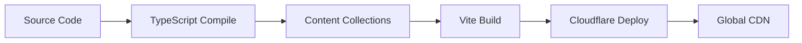

# CLAUDE.md

This file provides guidance to Claude Code (claude.ai/code) when working with code in this repository.

## Architecture Overview

This is a full-stack React Router v7 application deployed to Cloudflare Workers with:

- **Frontend**: React 19 with TypeScript, TailwindCSS v4, Radix UI components
- **Backend**: Cloudflare Workers with D1 database (SQLite) + R2 storage
- **Routing**: React Router v7 with SSR, file-based routing in `app/routes/`
- **I18n**: Internationalization support with English/Spanish via i18next
- **Auth**: Better-auth for authentication
- **API**: tRPC for type-safe API calls between client/server
- **Content**: Markdown content via content-collections

## Key Directories

- `app/` - Main application code
  - `components/` - React components (Radix UI-based design system)
  - `routes/` - React Router routes (file-based routing)
  - `server/` - Server-side code (Cloudflare Workers context)
  - `lib/` - Shared utilities and hooks
  - `locales/` - i18n translations (en/es)
- `workers/` - Cloudflare Worker entry point (`app.ts`)
- `posts/` - Markdown content for static pages
- `public/` - Static assets

## Environment Setup

Required environment variables (see `wrangler.jsonc`):

- `BETTER_AUTH_URL` - Auth service URL
- `R2_*` - Cloudflare R2 storage credentials
- `GOOGLE_CLIENT_ID` - Google OAuth client ID

Database: Uses Cloudflare D1 (SQLite) with binding `DB`

## I18n Structure

- Routes support `/:locale?` prefix (optional)
- Supported languages: English (en), Spanish (es)
- Translation files in `app/locales/` and `app/locales/json/`
- Automatic locale detection with cookie-based persistence

## 项目概述

这是一个基于 React Router v7 和 Cloudflare Workers 的全栈 Web 应用，采用现代前端技术栈，支持国际化、身份验证和数据库集成。

## 技术栈

### 前端技术

- **React Router v7** - 全栈框架，支持 SSR/SSG
- **React 19** - 最新 React 版本
- **TypeScript** - 类型安全
- **Tailwind CSS v4** - 原子化 CSS 框架
- **Radix UI** - 无障碍 UI 组件库
- **Shadcn/ui** - 现代 UI 组件系统
- **@react-icons** 现代 Icons 组件

### 后端技术

- **Cloudflare Workers** - 边缘计算平台
- **D1 Database** - SQLite 边缘数据库
- **tRPC** - 类型安全的 API 层
- **Better Auth** - 现代身份验证解决方案
- **Kysely** - 类型安全 SQL 查询构建器

### 国际化

- **i18next** - 国际化框架
- **remix-i18next** - React Router 集成
- **多语言支持** - 英语等

### 文件结构

```
my-singing-brainrot/
├── app/                          # 主要应用代码
│   ├── routes/                   # 路由文件
│   │   ├── home.tsx             # 首页
│   │   ├── locale-layout.tsx    # 国际化布局
│   │   ├── api/                 # API 路由
│   │   │   ├── auth.ts         # 身份验证
│   │   │   ├── trpc.ts         # tRPC 端点
│   │   │   └── locales.ts      # 国际化 API
│   │   └── support-pages/       # 静态页面
│   ├── components/              # React 组件
│   │   ├── ui/                  # Shadcn UI 组件
│   │   ├── header.tsx          # 头部组件
│   │   ├── footer.tsx          # 底部组件
│   │   └── analytics.tsx       # 分析脚本
│   ├── lib/                     # 工具库
│   │   ├── utils.ts            # 通用工具
│   │   ├── auth-client.ts      # 认证客户端
│   │   └── trpc-client.ts      # tRPC 客户端
│   ├── server/                  # 服务端代码
│   │   ├── auth.server.ts      # 认证配置
│   │   ├── cf.server.ts        # Cloudflare 上下文
│   │   ├── i18n.server.ts      # 国际化配置
│   │   └── trpc/               # tRPC 配置
│   ├── locales/                 # 国际化资源
│   │   ├── en.ts               # 英语配置
│   │   ├── ms.ts               # 马来语配置
│   │   └── json/               # 翻译文件
│   └── app.css                  # 全局样式
├── workers/                     # Cloudflare Workers
├── public/                      # 静态资源
├── docs/                        # 文档
└── posts/                       # Markdown 内容
```

## 核心功能模块

### 1. 国际化系统

- **语言检测**: 基于 URL 路径和 Cookie
- **语言切换**: 动态语言切换
- **翻译管理**: JSON 文件存储翻译
- **支持语言**: 英语 (en)、马来语 (ms)

### 2. 身份验证系统

- **OAuth 提供商**: Google OAuth 集成
- **会话管理**: Cookie-based 会话
- **用户数据**: 存储在 D1 数据库
- **API 保护**: tRPC 上下文集成

### 3. 数据层

- **数据库**: Cloudflare D1 (SQLite)
- **ORM**: Kysely 类型安全查询
- **API**: tRPC 类型安全 API
- **缓存**: 边缘缓存策略

### 4. UI 系统

- **设计系统**: Shadcn/ui + Radix UI
- **样式**: Tailwind CSS v4
- **主题**: 支持明暗主题
- **组件**: 可复用 UI 组件库

## 部署架构

### 环境配置

- **开发环境**: 本地开发服务器
- **预发布**: Cloudflare Workers 预览
- **生产环境**: Cloudflare Workers 全球部署

### 构建流程



### 环境变量

- **GOOGLE_CLIENT_ID**: Google OAuth 客户端 ID
- **GOOGLE_CLIENT_SECRET**: Google OAuth 密钥
- **DATABASE_URL**: D1 数据库连接

## 性能优化

### 边缘优化

- **地理位置**: 就近部署
- **缓存策略**: 静态资源缓存
- **CDN**: Cloudflare 全球网络

### 前端优化

- **代码分割**: 路由级别代码分割
- **懒加载**: 组件懒加载
- **图片优化**: 响应式图片

### 数据库优化

- **索引策略**: 关键字段索引
- **查询优化**: 高效 SQL 查询
- **连接池**: 数据库连接管理

## 安全考虑

### 身份验证

- **JWT Token**: 安全令牌
- **HTTPS**: 强制 HTTPS
- **CSRF 保护**: 跨站请求伪造保护

### 数据安全

- **输入验证**: Zod 模式验证
- **SQL 注入防护**: 参数化查询
- **XSS 防护**: 内容安全策略

## 开发工作流

### 本地开发

```bash
# 安装依赖
pnpm install

# 启动开发服务器
pnpm dev

# 类型检查
pnpm typecheck

# 构建生产版本
pnpm build

# 部署到 Cloudflare
pnpm deploy
```

### 代码质量

- **TypeScript**: 严格类型检查
- **ESLint**: 代码规范
- **Prettier**: 代码格式化

## 总结

该项目采用现代全栈架构，充分利用 Cloudflare 的边缘计算能力，提供高性能、可扩展的 Web 应用。通过 React Router v7 的 SSR 能力、tRPC 的类型安全 API、以及完善的国际化支持，构建了一个生产就绪的应用架构。
